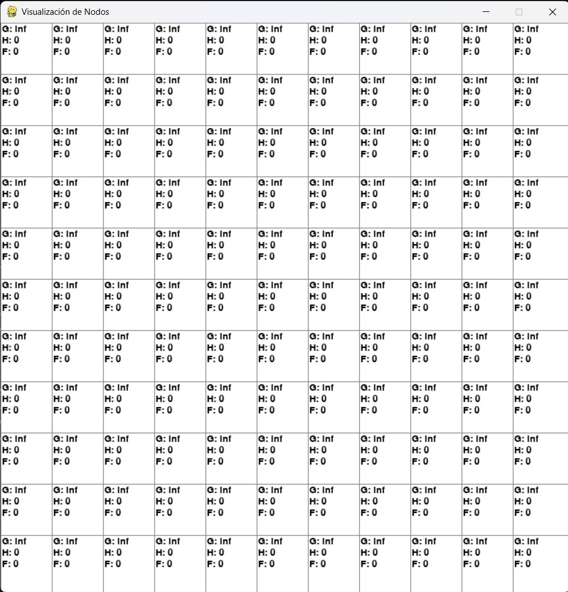
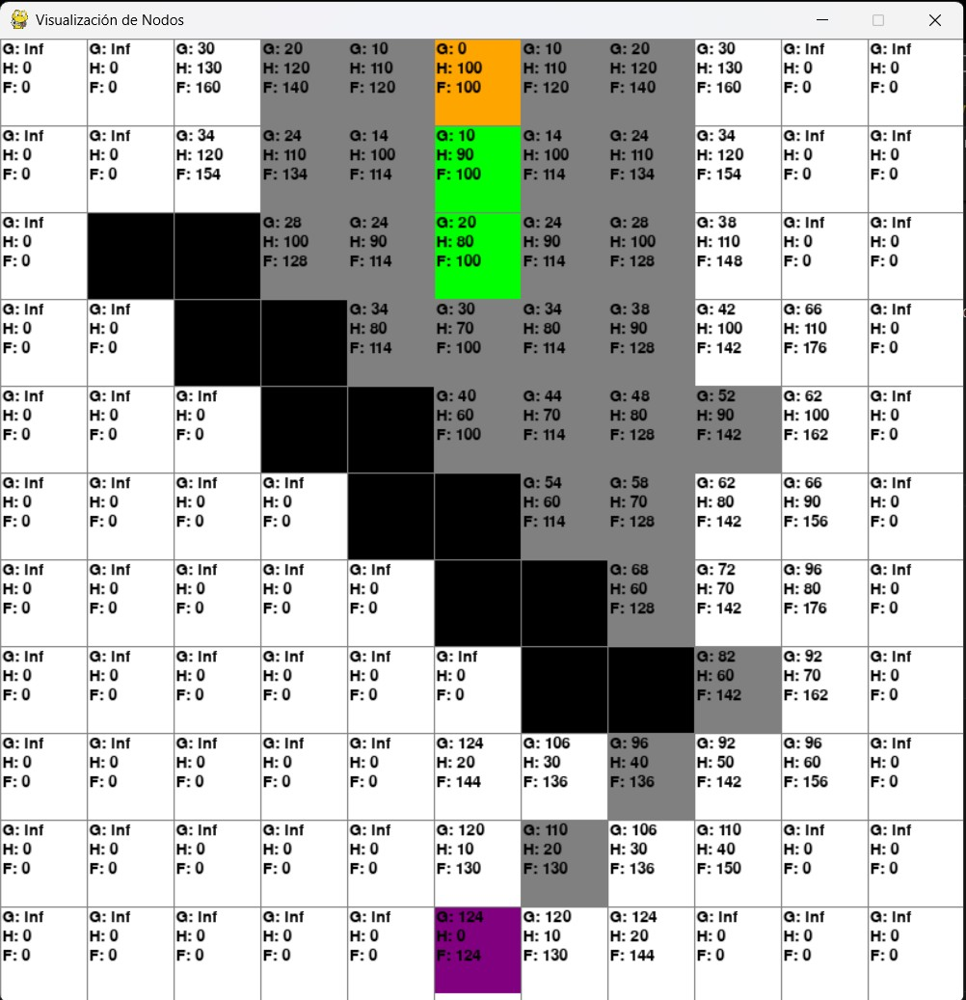

# Apuntes-Actividades-IA
Repositorio de apuntes, Alberto Vilchez Hurtado, actividades y proyectos de la materia de IA.
---

## Actividad de Algoritmo A* con visualización interactiva en Python y pygame

En esta actividad se implementa el algoritmo A* de búsqueda heurística en una cuadrícula visual interactiva utilizando Python y la librería gráfica Pygame. El objetivo es visualizar el recorrido óptimo desde un punto de inicio hasta un punto final sorteando obstáculos representados por nodos "pared".

### **Objetivos de la Actividad**

- Implementar el algoritmo A* de búsqueda heurística.
- Visualizar interactivamente el funcionamiento del algoritmo.
- Comprender cómo afectan los valores heurísticos en el rendimiento del algoritmo.

### **Herramientas y tecnologías utilizadas**

- Python
- Librería Pygame
- Algoritmo de búsqueda A*

## **Descripción del Algoritmo Implementado (A*)**

El algoritmo A* es una técnica eficiente para encontrar caminos óptimos utilizando una heurística que ayuda a guiar la búsqueda.

- **Nodo Inicial (Inicio)**  
  Nodo donde comienza la búsqueda.

- **Nodo Objetivo (Fin)**  
  Nodo hacia el cual se dirige la búsqueda.

- **Nodo Pared**  
  Representa obstáculos por donde el camino no puede pasar.

- **Nodo Abierto**  
  Nodos candidatos a ser explorados.

- **Nodo Cerrado**  
  Nodos que ya han sido explorados.

- **Heurística (H)**  
  Se utiliza la Distancia Manhattan, que calcula el costo aproximado desde el nodo actual al nodo objetivo.

- **Costo Real (G)**  
  Costo desde el nodo inicial al nodo actual.

- **Función de Evaluación (F)**  
  Se calcula como \( F = G + H \). El algoritmo prioriza los nodos con menor valor de F.

## **Configuración del Ambiente**

Se crea una cuadrícula interactiva definida por un único parámetro de tamaño (`FILAS`). Por ejemplo, una cuadrícula 10x10:
FILAS = 10

## Estados visuales de los nodos por colores:

- **Nodo Inicio**: Naranja  
- **Nodo Fin**: Púrpura  
- **Nodo Pared**: Negro  
- **Camino recorrido**: Verde  
- **Nodo abierto o explorado**: Gris  

## Visualización del Proceso

- La búsqueda se inicia al presionar la tecla E.  
- Puedes definir nodos de inicio y fin haciendo **click izquierdo** en las posiciones deseadas.  
- Las paredes (obstáculos) también se agregan con **clicks izquierdos adicionales**.  
- **Click derecho** restablece un nodo.

## Funciones Clave del Programa

- crear_grid(filas, ancho)  
  Crea una cuadrícula de tamaño filas x filas.

- dibujar(grid)  
  Actualiza visualmente la cuadrícula.

- obtener_click_pos(pos) 
  Calcula la posición exacta del click en la cuadrícula.

- calcular_heuristica(nodo, fin)  
  Calcula la distancia Manhattan para estimar el costo heurístico.

- a_star(grid, inicio, fin) 
  Implementación del algoritmo A*.

## Ejemplo de ejecución del programa

El programa visualiza en tiempo real cómo avanza el algoritmo A* desde el nodo inicial al final, evitando las paredes definidas por el usuario y eligiendo el camino mas varato segun sus F:

1. **Definir Inicio y Fin con clicks**:
   - **Inicio**: Naranja  
   - **Fin**: Púrpura  

2. **Definir paredes**:
   - **Paredes**: Negro  

3. **Definir paredes**:
   - **Paredes**: Negro  

4. **Presionar tecla E** para ejecutar el algoritmo A*.

## Preguntas y respuestas relevantes

- **¿Qué heurística se usó y por qué?**  
  Se usó la **Distancia Manhattan**, ya que es más adecuada para movimientos en cuadrículas(aunque en el ejercicio permitimos diagonal con un costo mayor).

- **¿Cuál es la complejidad del algoritmo?**  
  La complejidad de A* puede variar dependiendo de la heurística.

- **¿Qué sucede si no hay camino posible?**  
  Si no existe un camino posible, el algoritmo explorará todos los nodos accesibles y no marcara un camino.

### Recursos Adicionales

- 
-  
- 
-  