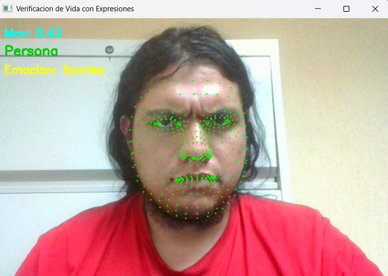
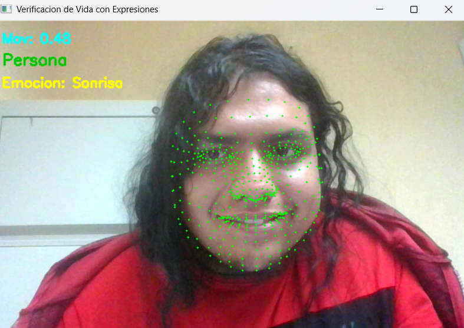
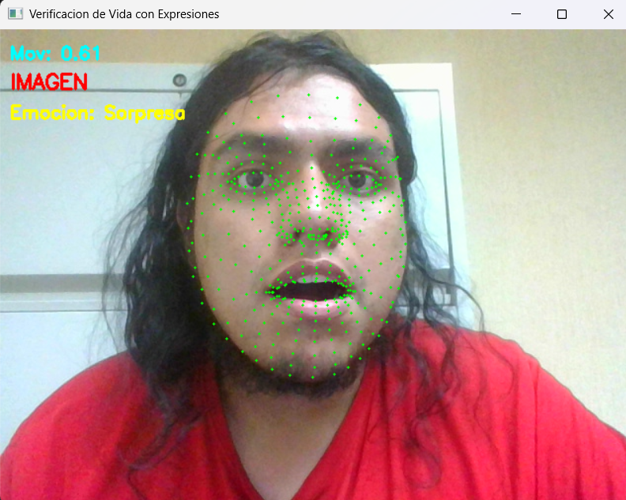
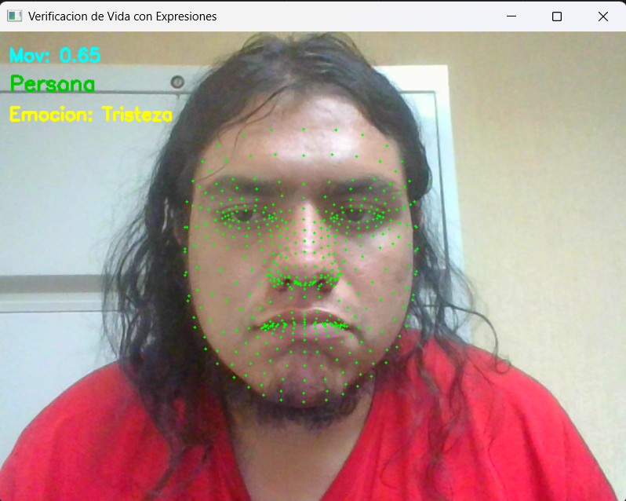

# Actividades-IA-Detecion de Emociones
Repositorio de apuntes, Alberto Vilchez Hurtado, actividades y proyectos de la materia de IA.
---

## Actividad para la detección de un rostro vivo y sus emociones

Para esta actividad intentaremos implementar por medio de la librería **MediaPipe** la detección de un rostro humano en tiempo real, reconociendo si se trata de una persona viva (en movimiento) o una imagen estática. Además, se identifican emociones como **tristeza**, **enojo**, **sorpresa** y **felicidad**.

Se utilizan **landmarks faciales** (puntos clave del rostro) que permiten inferir expresiones y evaluar si hay actividad facial real.

---

### **Índices faciales para expresiones**

BOCA_IZQUIERDA = 61
BOCA_DERECHA = 291
BOCA_SUPERIOR = 13
BOCA_INFERIOR = 14
CEJA_IZQUIERDA = 21
CEJA_DERECHA = 22
PARPADO_SUPERIOR = 159
PARPADO_INFERIOR = 145


- https://storage.googleapis.com/mediapipe-assets/documentation/mediapipe_face_landmark_fullsize.png
---

### **Objetivos de la Actividad**

- Implementar la detección de un rostro humano en tiempo real.
- Verificar si se trata de una persona viva o una imagen.
- Detectar expresiones faciales usando puntos clave.
- Visualizar en pantalla la emoción detectada dinámicamente.
- Registrar movimiento para evitar falsos positivos (como fotos impresas).

---

### **Herramientas y tecnologías utilizadas**

- Python
- mediapipe
- OpenCV
- Numpy

---

## **Descripción del Algoritmo Implementado**

El algoritmo consta de los siguientes pasos principales:

1. **Captura de video:** Se accede a la cámara en tiempo real usando OpenCV.
2. **Procesamiento facial con MediaPipe:** Se obtienen los landmarks (puntos faciales) de la persona.
3. **Verificación de vida:** Se calcula la variación del rostro entre frames. Si no hay movimiento por un tiempo determinado, se asume que es una imagen.
4. **Detección de emociones:** Se utilizan relaciones geométricas entre puntos clave para detectar:
   - **Sorpresa:** Boca y ojos muy abiertos.
   - **Enojo:** Cejas cercanas a los párpados superiores.
   - **Tristeza:** Comisuras de la boca caídas.
   - **felicidad:** Comisuras de la boca en alto.

---

## **Configuración del Ambiente**

1. Instalar dependencias:
   ```bash
   pip install opencv-python mediapipe numpy

   ## **librerias necesarias para el funcionamiento**

El programa muestra en tiempo real:

- El rostro detectado con puntos verdes.
- Un texto que indica si se detecta una **Persona** o una **Imagen**.
- El nivel de movimiento facial (en píxeles promedio).
- La emoción actual del rostro (si se detecta).

---

## **Funciones Clave del Programa**

- `calcular_distancia(p1, p2)`: Devuelve la distancia euclidiana entre dos puntos.
- `detectar_tristeza()`: Detecta tristeza si las comisuras de la boca están caídas.
- `detectar_enojo()`: Detecta enojo si las cejas están muy cerca de los párpados superiores.
- `detectar_sorpresa()`: Detecta sorpresa si ojos y boca están abiertos.
- `detectar_sonrisa()`: Se mantiene en el código pero no se muestra en pantalla por ambigüedad.

---

## **Ejemplo de ejecución del programa**

Al ejecutar el programa, se activa la cámara y se observa una interfaz con los puntos del rostro en tiempo real. Según las expresiones que hagas, en la parte inferior aparece un texto como:

- 
- 
- 
- 