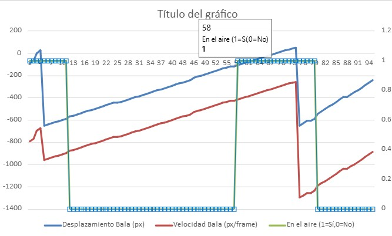
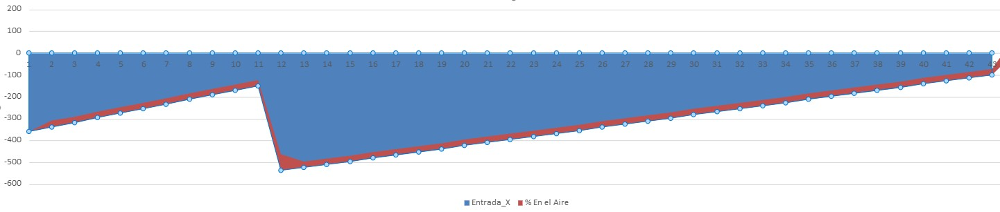
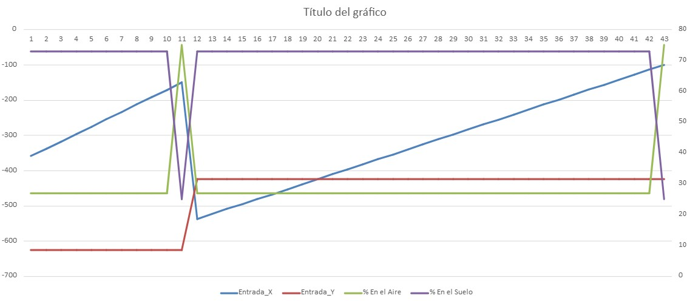

# Apuntes-Actividades-IA
Repositorio de apuntes, Alberto Vilchez Hurtado, actividades y proyectos de la materia de IA.
## 1.- Actividad graficas de phaser

En esta actividad, comparando dos modos diferentes: **Manual** (control humano) y **Automático** (controlado por inteligencia artificial entrenada con datos humanos). 

## Modos del Juego
### Modo Manual
Controlamos directamente con espacio y asi decidimos cuándo saltar para esquivar las balas. Este modo genera los datos necesarios para entrenar al personaje en modo automático.

### Modo Automático
Se toman decisiones autónomas basándose en patrones aprendidos del modo manual, usando redes neuronales entrenadas previamente con los datos del modo manual.

### GráficaManual: Posición Bala y Estado (En Aire / En Suelo)

- **bala** Desplazamiento de la bala (posición horizontal, en píxeles).
  - `1`: Personaje en el aire (saltando)
  - `0`: Personaje en el suelo
- 
Se puede observar que dependiendo de la velociadd y desplazamiento de la bala se salta para evitarla, de esta manera estamos entrenando el modelo que seguira mas adelante repitiendo de cierta forma nuestra estrategia de juego.
    
### GráficaAutomata: Distribución de Estados (Porcentajes Aire vs Suelo)

- 
- La usamos para evaluar visualmente en qué posiciones el personaje decide saltar según lo aprendido.
Esto nos Permite evaluar el desempeño general del personaje y su capacidad de reacción ante las diferentes velocidades y posiciones de las balas, por su puesto en base a nuestro entrenamiento, por lo que si se entrena muy pobremente puede generar fallos que proboquen que perdamos la partida.

- 
- Muestra el porcentaje del tiempo que el personaje pasa en el aire y en el suelo.
Permite que evaluemos el desempeño general del personaje y su capacidad de reacción ante las diferentes velocidades y posiciones de las balas.

## Conclusiones Preliminares

- El Modo automático demuestra patrones similares alos que utilizamos en cuanto al momento de realizar saltos.
- Se identifican claramente las posiciones críticas donde la IA toma la decisión de saltar, demostrando una buena adaptación del modelo entrenado.