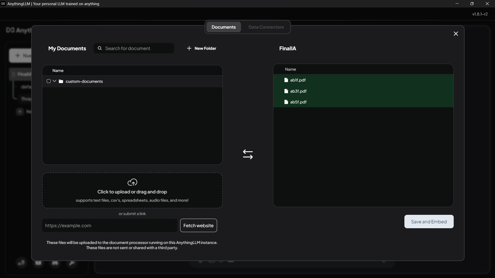
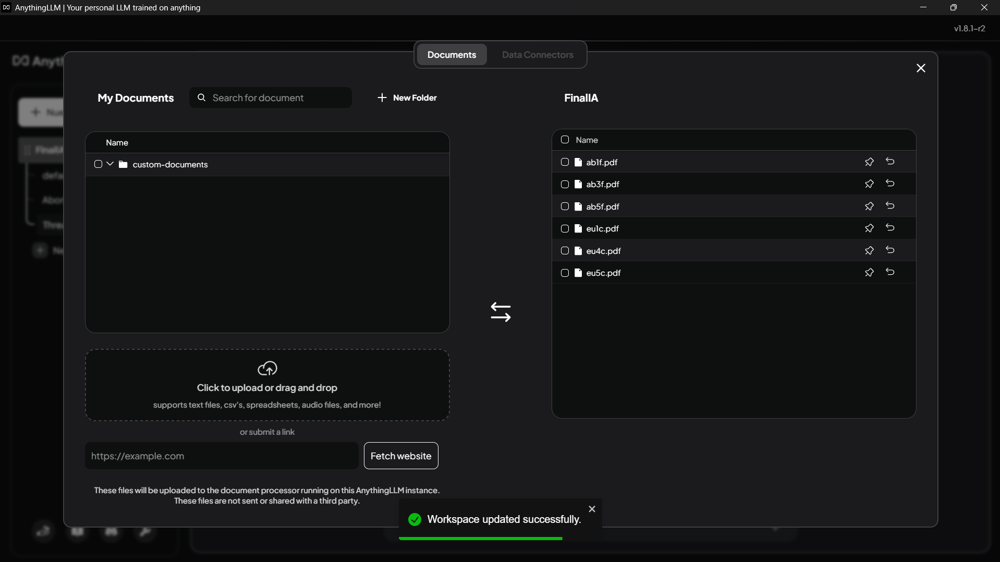

# Proyecto 3: Análisis Ético y Tecnológico con Modelos de Lenguaje Natural

## Objetivo General

El objetivo de este proyecto es desarrollar un video y un documento analítico utilizando modelos avanzados de lenguaje natural (por ejemplo, Ollama y AnythingLLM), que permitan generar embeddings, realizar fine-tuning y analizar documentos PDF para abordar temas éticos complejos relacionados con la autonomía personal y decisiones de vida o muerte en la era de la inteligencia artificial.

---

## Objetivos Específicos

- Aplicar técnicas de procesamiento de lenguaje natural para analizar preguntas éticas profundas.
- Subir y analizar documentos PDF mediante AnythingLLM para identificar posturas (a favor, en contra, neutrales) respecto a los temas tratados.
- Generar embeddings semánticos para organizar y comparar información relevante.
- Realizar fine-tuning de modelos de lenguaje para mejorar la comprensión y generación de respuestas.
- Documentar contradicciones y convergencias en las posturas extraídas de los documentos.
- Elaborar un documento reflexivo y un video explicativo que integren las respuestas y análisis generados por la IA.
- Estudiar la interacción entre ética, lenguaje, y tecnología en contextos sensibles como el aborto y la eutanasia.

---

## Tecnologías y Metodologías

- **Modelos de Lenguaje Natural:** Uso de Ollama y AnythingLLM para generación, análisis y fine-tuning.
- **Análisis de Documentos PDF:** Carga y procesamiento de textos para extracción de posturas y argumentos.
- **Embeddings:** Extracción de representaciones vectoriales semánticas para análisis comparativo y clustering.
- **Detección de Posturas:** Clasificación de documentos o fragmentos en categorías (a favor, en contra, neutral).
- **Identificación de Contradicciones:** Documentación de discrepancias y debates dentro del corpus analizado.
- **Producción Multimedia:** Creación de video explicativo basado en los resultados del análisis automatizado.
- **Revisión Ética:** Incorporación de principios éticos clásicos y contemporáneos para fundamentar las respuestas.

---

## Estructura

1. **Recolección de Preguntas y Documentos:**  
   Definición clara de interrogantes y recopilación de documentos PDF relevantes para cada tema.

2. **Carga y Análisis con AnythingLLM:**  
   Subida de PDFs, extracción de contenido, y análisis de postura y contradicciones.

3. **Generación y Afinamiento del Modelo:**  
   Entrenamiento y ajuste del modelo de lenguaje natural para responder preguntas y relacionar con los documentos.

4. **Análisis de Respuestas y Posturas:**  
   Interpretación crítica y organización del contenido generado junto con las posturas detectadas en los documentos.

5. **Elaboración del Documento Final:**  
   Integración de respuestas, análisis, contradicciones y conclusiones.

6. **Producción del Video:**  
   Síntesis visual y auditiva del contenido para divulgación.

### Aviso 
- Se informa por este medio que, debido a temas de censura, fue necesario proporcionar un contexto específico para que la IA respondiera las preguntas. Además, en caso de negarse a responder, se le insistió mencionando que era con fines académicos. Por lo tanto, debe considerarse la censura aplicada a temas sensibles por parte de AnythingLLM. Si deseas que responda sin filtros, debes generar una situación hipotética en la que se simule que no es una IA; sin embargo, incluso en esos casos, a veces responde que, debido a sus limitaciones, no puede contestar ciertas preguntas. Esto debe tenerse en cuenta.

### Recursos Adicionales

- 
- 