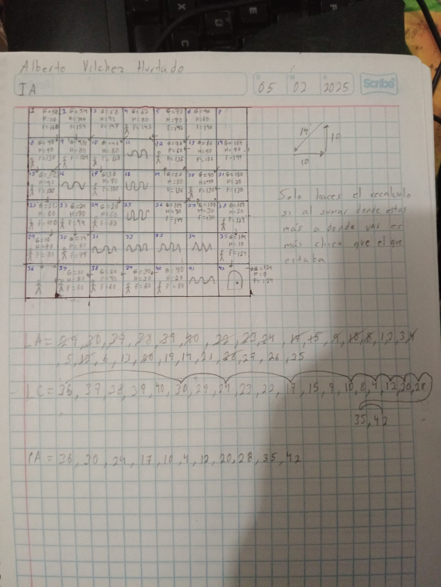
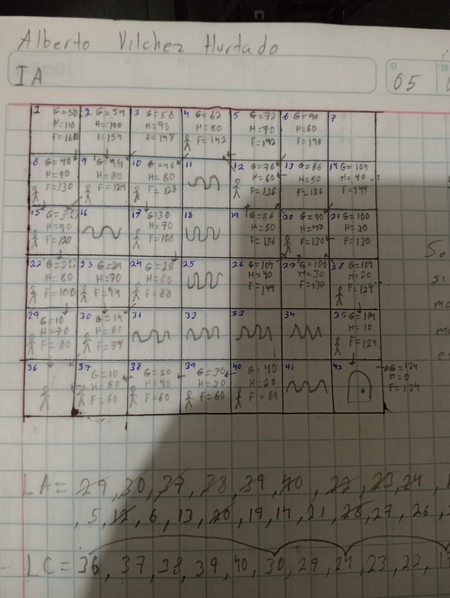

Apuntes-Actividades-IA

Repositorio de apuntes, actividades y proyectos de la materia de IA, de Melvin Marin Gonzalez.

1.- Actividad 05/02/2025

En esta actividad, se debe determinar el camino más eficiente desde un punto de inicio (A) hasta un punto objetivo (B) dentro de una cuadrícula. Para ello, se aplican conceptos de teoría de grafos y se realizan cálculos específicos para evaluar los costos de desplazamiento.

📌 Normas de Movimiento en la Cuadrícula

Tipos de movimientos permitidos:

Movimiento horizontal o vertical: Cada desplazamiento en estas direcciones tiene un costo de 10 unidades.

Movimiento en diagonal: Desplazarse en diagonal implica un costo mayor de 14 unidades.

Cálculo del costo total:

G (Costo acumulado): Es el total del costo de los movimientos efectuados desde el inicio hasta la posición actual.

Por ejemplo, si el primer movimiento es horizontal, entonces G = 10.

Si después se mueve en diagonal, el nuevo valor será G = 10 + 14 = 24.

H (Costo heurístico): Es una estimación del costo restante para llegar a la meta, calculado en función de los movimientos necesarios.

F (Costo total estimado): Se obtiene sumando G y H, es decir: F = G + H.

🔍 Procedimiento para Encontrar el Camino Óptimo

Inicio del proceso:

Se parte desde el punto inicial (A) con un costo G = 0.

Exploración de movimientos posibles:

Se analizan las posiciones adyacentes disponibles en la cuadrícula (Lista Abierta o LA).

Se calcula para cada posición los valores G, H y F.

Selección del mejor movimiento:

Se elige la celda con el menor valor de F.

En caso de empate en F, se usa otro criterio para decidir cuál se evalúa primero.

Avance progresivo hasta la meta (B):

Se repite el proceso hasta alcanzar el destino.

Se registran los cálculos en cada paso dentro de la Lista Cerrada (LC), que almacena los nodos ya evaluados.

### Recursos Adicionales

- 
-  
